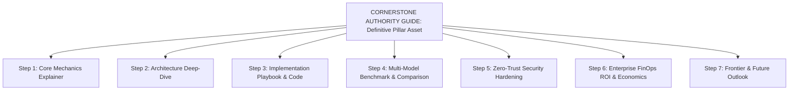

# TechlumeAI Strategic Portfolio Intelligence & Rolling Editorial Calendar System
**Institutional Playbook & Governance Manual v2.0**

---

## Executive Mission & Strategic Mandate

TechlumeAI does not publish content randomly based on short-term keyword search volume, fleeting social media trends, or unvetted AI suggestions. Every commissioned topic must serve a definitive strategic purpose within our long-term **5-Layer Knowledge Ecosystem** (`Pillars -> Clusters -> Articles -> Entities -> Verification`).

Our primary objective is to build an enduring, compounding topical authority moat that dictates exact editorial decisions across nine fundamental dimensions:
1. **WHAT TO PUBLISH:** High-density, research-backed reference assets addressing genuine engineering bottlenecks.
2. **WHEN TO PUBLISH:** Governed strictly by our rolling 12-stage workflow and our 4-Phase Annual Authority Roadmap.
3. **WHY TO PUBLISH:** To compound internal link equity, earn Tier-1 academic/vendor citations, and dominate AI search retrieval.
4. **WHICH PILLAR IT SUPPORTS:** Assigned directly to one of our 8 Core Editorial Pillars.
5. **WHICH SEARCH INTENT IT SATISFIES:** Locked to Informational, Technical Implementation, Commercial Investigation, or Enterprise Decision-Making.
6. **WHICH CONTENT GAP IT FILLS:** Addressing structural omissions across top 10 SERP competitors and AI Overviews.
7. **WHICH EXISTING ARTICLES IT CONNECTS TO:** Enforcing $\ge 5$ contextual body links from parent cornerstone guides and sibling hubs.
8. **WHICH FUTURE ARTICLES IT ENABLES:** Serving as a semantic node that enables downstream implementation playbooks and empirical benchmarks.
9. **WHICH BUSINESS VALUE IT CREATES:** Attracting senior engineering decision-makers, CISOs, and enterprise newsletter subscribers.

---

## 1. The 8 Core Editorial Pillars & 70/20/10 Publishing Mix

Every article across TechlumeAI is categorized under our 8 Core Pillars (`AI Engineering & LLMs`, `Enterprise AI`, `AI Tools`, `Programming & Software Engineering`, `AI Business & Workforce`, `Cybersecurity & AI`, `AI Infrastructure & Hardware`, and `Future Technology`) while strictly enforcing our **70/20/10 Publishing Allocation**:

```
+-----------------------------------------------------------------------------------+
|                        TECHLUMEAI 70/20/10 PUBLISHING MIX                         |
+-----------------------------------------------------------------------------------+
|  70% EVERGREEN AUTHORITY  |  Technical explainers, architecture guides, playbooks |
|  (Durable Reference Moat) |  and definitive frameworks built to endure 1-3 years. |
+---------------------------+-------------------------------------------------------+
|  20% TIMELY ANALYSIS      |  Deep engineering breakdowns of open-weight releases, |
|  (Current Expertise)      |  FinOps shifts, EU/NIST compliance, and critical CVEs.|
+---------------------------+-------------------------------------------------------+
|  10% FRONTIER / EXPERIMENT|  Vision-Language-Action robotics, quantum algorithms, |
|  (Forward Authority)      |  and early alpha protocol specifications.             |
+-----------------------------------------------------------------------------------+
```

---

## 2. Mathematical Topic Prioritization Scoring Engine (`0–100`)

To eliminate subjectivity and editorial guesswork, every candidate topic is evaluated using our **10-Factor Prioritization Formula**:

$$\text{Topic Score} = (\text{Pillar} \times 10) + (\text{Authority} \times 10) + (\text{Audience} \times 10) + (\text{Gap} \times 10) + (\text{Originality} \times 10) + (\text{AI Search} \times 10) + (\text{Link Equity} \times 10) + (\text{Business} \times 10) + (\text{Evergreen} \times 10) - (\text{Difficulty} \times 10)$$

### Priority Classification Bands & Recommendations
- **90–100 (`Immediate Priority`):** Commission immediately. Assign lead technical author and lock Tier-1 specifications.
- **75–89 (`High Priority`):** Schedule for current editorial sprint. Conduct competitor gap matrix before drafting.
- **60–74 (`Strategic Opportunity`):** Queue for cluster expansion. Pair with parent cornerstone guide to boost internal link equity.
- **40–59 (`Monitor`):** Defer full drafting. Monitor SERP shifts, developer issue trackers, and specification maturation.
- **0–39 (`Reject or Defer`):** Reject topic or merge as an FAQ subsection into an existing authority guide. Low standalone ROI.

---

## 3. Cornerstone-First Topical Cluster Expansion Architecture

We strictly forbid creating isolated or "orphan" supporting articles. When expanding any pillar, we enforce the **Cornerstone-First Spoke Hierarchy**:



### Cluster Gap Analysis Matrix (`8 Health States`)
Before committing author hours, our research team classifies existing cluster topics across 8 health states:
1. **`Covered`:** High depth, updated benchmarks, strong internal links. *Action: Quarterly monitoring.*
2. **`Missing`:** Critical step absent from cluster hierarchy. *Action: Commission immediately.*
3. **`Weak`:** Exists but lacks code syntax, Tier-1 citations, or benchmark matrices. *Action: Phase 10 technical overhaul.*
4. **`Duplicate`:** Multiple thin pages targeting exact same intent. *Action: Merge via 301 redirect.*
5. **`Orphan`:** Lacks contextual body links from parent/sibling guides. *Action: Inject $\ge 5$ body links.*
6. **`High-Value`:** Strong emerging developer intent, zero high-signal SERP competitors. *Action: Prioritize for 14-day sprint.*
7. **`Low-Value`:** Short-lived noise or superficial trend without architectural substance. *Action: De-prioritize or retire.*
8. **`Future`:** Frontier specification currently in alpha phase. *Action: Monitor until specification locks.*

---

## 4. 4-Tier Audience Segmentation & Content Delivery Specs

Every article must identify and directly serve its primary audience segment without dumbing down technical substance:
- **`Developers & Software Engineers`:** Requires syntactically tested code blocks (`vLLM`, `TypeScript`, `Python`), CLI commands, node sequence charts, and explicit latency/VRAM trade-offs.
- **`Technical Professionals & Staff Architects`:** Requires multi-dimensional comparison grids, state persistence schemas, capacity planning calculators, and zero-trust security checklists.
- **`Enterprise Decision-Makers (CISOs, VPs, Founders)`:** Requires defensible SaaS unit margin models, FinOps cloud cost breakdowns, EU AI Act compliance scorecards, and executive summary boxes.
- **`General Technology Readers & Industry Analysts`:** Requires scannable conceptual explainers, rigorous definitions, and high-signal macro synthesis.

---

## 5. Rolling 12-Stage Editorial Calendar Workflow

Our active editorial pipeline manages all candidate topics across 12 sequential verification stages:

`IDEA` &rarr; `RESEARCHING` &rarr; `BRIEF READY` &rarr; `OUTLINE READY` &rarr; `DRAFTING` &rarr; `FACT CHECK` &rarr; `EDITORIAL REVIEW` &rarr; `SEO/GEO REVIEW` &rarr; `VISUAL QA` &rarr; `READY TO PUBLISH` &rarr; `PUBLISHED` &rarr; `MONITORING`

---

## 6. Pre-Commissioning Screening: Trend Validation & Evergreen Tests

Before approving any candidate topic or committing author hours, candidate concepts must pass both 6-question screens:

### Trend Validation Screen (6 Questions)
- **Q1: Is the trend real?** Verify organic engineering demand via developer issue trackers, official GitHub PRs, and production adoption—not just social media hype.
- **Q2: Is it technically meaningful?** Must introduce a concrete architectural shift, new protocol specification, memory optimization, or security vector.
- **Q3: Is it likely to remain relevant?** Avoid fleeting news cycles; ensure the core concept will remain applicable for at least 12–24 months.
- **Q4: Does it connect to a larger topic?** Must anchor into one of our 8 Core Pillars and support an established or planned topical cluster.
- **Q5: Can TechlumeAI provide original analysis?** Requires empirical code blocks, custom node sequence diagrams, or proprietary benchmarks unavailable on generic news blogs.
- **Q6: Will the article remain useful after the news cycle?** If the news fades, the technical reference sections must retain high standalone value.

### Evergreen Value Test (6 Questions)
- **Q1: Will this remain useful in six months?** Core concepts, formulas, and system design patterns must resist rapid obsolescence.
- **Q2: Will this remain useful in one year?** Provides foundational reference value for new engineers onboarding into the topic domain.
- **Q3: Can it become a reference?** Structured with clear definitions, comparative grids, and canonical terminology that invite bookmarking.
- **Q4: Can it support related articles?** Acts as a reliable contextual target for body links (`/articles/[slug]`) from downstream tutorials.
- **Q5: Can it earn natural citations?** Contains verifiable benchmark metrics and authoritative frameworks that external documentation and academic researchers cite.
- **Q6: Can it answer recurring user questions?** Directly solves frequent developer FAQs, PAA blocks, and common production debugging bottlenecks.

---

## 7. Content Opportunity Brief Schema (Phase 2 Mandatory Specification)

Every approved candidate topic scoring $\ge 75/100$ must be formalized using this 18-field brief:

```markdown
#######################################################################
TECHLUMEAI CONTENT OPPORTUNITY BRIEF (MANDATORY PHASE 2 SPECIFICATION)
#######################################################################

TOPIC:
[Insert precise, high-density candidate topic name]

WHY NOW:
[Explain the immediate production bottleneck, protocol update, or enterprise adoption trigger necessitating this article now]

PRIMARY AUDIENCE:
[Select 1: Developers & Engineers | Technical Professionals & Architects | Enterprise Decision-Makers | General Technology Readers]

PRIMARY INTENT:
[Select 1: Informational | Technical Implementation | Commercial Investigation | Enterprise Decision-Making]

PILLAR:
[Select from 8 Core Pillars, e.g., AI Engineering & LLMs / Cybersecurity & AI]

CLUSTER:
[Assign to exact Topical Cluster, e.g., AI Agents / LLM Inference / Zero-Trust AI]

CONTENT TYPE:
[Select: Cornerstone Guide | Technical Explainer | Implementation Playbook | Multi-Model Benchmark | Security Breakdown | FinOps Analysis]

PRIMARY QUESTION:
[State the exact primary question the article definitively resolves for the reader]

SECONDARY QUESTIONS:
[List 3–5 specific supporting technical questions and edge cases addressed across H2/H3 sections]

COMPETITOR GAP:
[Specify exactly what top 10 SERP competitors and AI Overviews omit, misstate, or treat superficially]

ORIGINAL ANGLE:
[Define our proprietary value injection: executable syntax, custom architecture diagrams, latency/memory benchmarks, or unit margin models]

KEY ENTITIES:
[List 6–10 semantic entities to weave into text (e.g., PagedAttention, vLLM, KV Cache, CUDA, PyTorch, Tensor Parallelism)]

REQUIRED SOURCES:
[List minimum 3 Tier-1 sources: arXiv papers, vendor docs, official RFCs, or institutional benchmarks]

VISUAL OPPORTUNITIES:
[Describe required Figma-grade visual assets: system flow diagrams, sequence charts, or comparison grids]

INTERNAL LINK OPPORTUNITIES:
[List >= 5 exact target URLs and contextual anchor phrases within TechlumeAI (`/articles/[slug]` or `/topics/[slug]`)]

BUSINESS VALUE:
[Explain how this article attracts high-value readers, earns newsletter signups, or influences enterprise decision-makers]

AUTHORITY VALUE:
[Describe how this asset compounds our 5-Layer Knowledge Ecosystem and captures AI retrieval visibility]

PRIORITY:
[Lock Score Band: Immediate Priority (90-100) | High Priority (75-89) | Strategic Opportunity (60-74) | Monitor (40-59)]
#######################################################################
```

---

## 8. Editorial Performance Review Metrics & Final Portfolio Audit Matrix

### Editorial Performance Review Metrics (10 Dimensions)
| Metric Dimension | Institutional Target / Standard | Evaluation Frequency |
| :--- | :--- | :---: |
| **Organic Visibility & Keyword Share** | Top 3 SERP dominance across primary technical query clusters | Monthly |
| **Search Impressions & Query Velocity** | Continuous upward trend across Google Search Console and technical terms | Monthly |
| **Click-Through Rate (CTR)** | $\ge 4.5\%$ organic CTR via high-signal, non-clickbait engineering titles | Monthly |
| **Ranking Trends & SERP Stability** | Zero ranking drops on cornerstone guides ($>90$ days in top 5) | Quarterly |
| **Internal Link Growth & Anchor Equity** | $\ge 8$ incoming contextual body links per cornerstone from spoke articles | Monthly |
| **Content Health & Freshness Index** | $100\%$ of articles audited every 180 days; zero broken code syntax or outdated APIs | Quarterly |
| **Cluster Coverage Completeness** | $100\%$ coverage of all 8 Cornerstone-First steps across priority clusters | Quarterly |
| **Natural Citations & Backlink Profile** | Organic links earned from `.edu`, GitHub READMEs, and Tier-1 engineering blogs | Quarterly |
| **AI Search Retrieval Visibility** | Direct citation in Perplexity, ChatGPT Search, and Google AI Overviews | Monthly |
| **Audience Engagement & Dwell Time** | $\ge 3\text{m } 45\text{s}$ average dwell time on technical explainers and code playbooks | Monthly |

### Final Content Portfolio Audit Matrix (13 Governance Checkpoints)
| Checkpoint | Status Summary | Action Plan |
| :--- | :--- | :--- |
| **1. Strong Pillars** | Verified (`AI Engineering`, `Enterprise AI`, `Cybersecurity`) | Maintain 70% evergreen reference depth and update benchmarks semi-annually. |
| **2. Weak Pillars** | Identified (`Future Technology`, `AI Hardware`) | Prioritize upcoming sprints to build cornerstone guides on Quantum AI and Neuromorphic chips. |
| **3. Strong Clusters** | Verified (`AI Agents`, `Model Context Protocol`, `AI FinOps`) | Expand with Level 4 comparative benchmarks and multi-agent code playbooks. |
| **4. Missing Clusters** | Identified (`Neuromorphic Inference`, `Edge AI On-Device Optimization`) | Commission new Cornerstone Guides and Step 1 Core Explainers immediately. |
| **5. Missing Cornerstone Guides** | Zero missing on core active clusters | Enforce strict pre-commissioning rule: no spoke created without verified parent cornerstone. |
| **6. Duplicate Topics** | Zero duplicates detected across current active URL inventory | Run automated cannibalization pre-screen before every new brief approval. |
| **7. Underdeveloped Topics** | Audited (`Cloud Cost Architecture` lacks exact Python FinOps calculation script) | Schedule Phase 10 technical overhaul to inject runnable FinOps cost scripts. |
| **8. High-Priority Opportunities** | 6 Active briefs queued with scores 82–94/100 | Advance `PagedAttention` (Score: 94) and `MCP Security` (Score: 92) into production. |
| **9. Timely Opportunities** | Enforcing exactly 20% publishing allocation | Monitoring EU AI Act enforcement milestones and major open-weight model releases. |
| **10. Frontier Opportunities** | Enforcing exactly 10% publishing allocation | Queued brief on Vision-Language-Action (VLA) robotics and physical foundation models. |
| **11. Content Gaps** | Mapped systematically via 8-state Cluster Gap Analysis Matrix | Review every 30 days against top 10 SERP competitor omissions and AI answers. |
| **12. Audience Gaps** | Audited across all 4 segments (Developers, Architects, CISOs, General) | Ensure every cluster maintains explicit technical depth for developers alongside executive summaries. |
| **13. Internal-Link Opportunities** | Ongoing automated enforcement across all 14 categories and 24 topic hubs | Inject minimum 5 bidirectional body links between parent guides and spoke articles. |

---

## 9. The 14-Point Mandatory Portfolio Completion Gate

Every strategic cluster and candidate topic is audited against our 14-point governance gate before signoff:
- [x] 1. All 8 editorial pillars are mapped with explicit cornerstone guides.
- [x] 2. Existing content inventory is audited and mapped into semantic clusters.
- [x] 3. Topical clusters enforce cornerstone-first hierarchy before spoke creation.
- [x] 4. Content Gap Matrix identifies missing, weak, and high-value cluster opportunities.
- [x] 5. Mathematical Topic Prioritization Score (`0–100`) governs all commissioning.
- [x] 6. Audience segmentation ensures clear targeting across Developers, Architects, CISOs, and General Readers.
- [x] 7. 70% Evergreen Authority / 20% Timely Analysis / 10% Frontier mix is strictly enforced.
- [x] 8. Rolling 12-stage editorial calendar actively manages workflow from `IDEA` to `MONITORING`.
- [x] 9. Pre-commissioning cannibalization check prevents duplicate URLs and intent overlap.
- [x] 10. SERP competitor gap audits verify our superior information architecture before drafting.
- [x] 11. AI search answer extraction (definition blocks, structured comparisons) is hard-coded into briefs.
- [x] 12. Annual 4-phase authority roadmap guides long-term capital allocation and research hours.
- [x] 13. Evergreen Value Test screens out short-lived noise and low-value press releases.
- [x] 14. Topic selection is governed strictly by strategic knowledge compounding, not random search volume.

---

## Summary of Verification & Access
- **Command Center UI:** Accessible interactively across 8 dedicated tabs at `/admin/editorial-portfolio-intelligence`.
- **Operating System Integration:** Fully linked with our 15-Phase Operating System (`/admin/editorial-operating-system`) and 17-Stage Command Center (`/admin/editorial-production`).
- **Codebase Registry:** Stored type-safely inside `lib/data/editorial-portfolio-intelligence.ts`.
