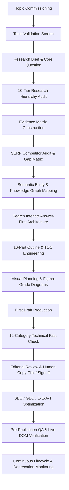

# TechlumeAI Enterprise Editorial Operating System & Production Manual
**Status:** Institutionalized & Live (`/admin/editorial-operating-system`)  
**Publication:** TechlumeAI (`https://techlumeai.com`)  
**Governance Authority:** Chief Technology Editors, Senior AI Researchers, and Semantic SEO Architects  

---

## Executive Summary: Institutional Mandate

TechlumeAI operates as a **demonstrably authoritative, expert-driven technology publication**. We do not publish content through random AI generation, thin trend summaries, or keyword containers. Every major technical guide, explainer, comparison, and benchmark report must progress through our **15-Phase Research & Production Pipeline** and pass our **22-Point Mandatory Completion Gate** before deployment.



---

## 1. Editorial Content Mix & Categories

TechlumeAI maintains a strict, signal-to-noise optimized publishing mix across our 8 technology pillars (`AI Engineering`, `Enterprise AI`, `AI Tools`, `Programming & Software Engineering`, `AI Business`, `Cybersecurity & AI`, `AI Infrastructure & Hardware`, and `Future Technology`):

| Category | Target Mix | Description |
| :--- | :---: | :--- |
| **Evergreen Technical Authority** | **70%** | Definitive architectural guides, enterprise implementation blueprints, protocols, and foundational explainers that gain authority and reference links over multi-year cycles. |
| **Timely Analysis & Developments** | **20%** | Deep technical analysis of major open-weight/proprietary model releases, cloud economics shifts, critical CVEs, and platform architecture updates. |
| **Experimental & Frontier Coverage** | **10%** | Investigation into emerging primitives like Vision-Language-Action (VLA) robotics, quantum machine learning, and custom silicon interconnects. |

> [!CAUTION]
> **Absolute Rejection Criteria:** We strictly reject breaking press releases without technical analysis, AI-generated summaries, thin listicles, and keyword pages lacking original synthesis.

---

## 2. The 6 Canonical Content Formats

Every published asset must conform to one of the following 6 structural specifications:

### 1. Flagship Guides (Definitive Industry Standards)
- **Examples:** *Complete Enterprise Guide to AI Agents*, *Complete MCP (Model Context Protocol) Guide*, *Prompt Engineering Master Guide*.
- **Required Elements:** Exhaustive architectural breakdown, real-world operator failure modes, Tier-1 primary specifications, multi-layered Table of Contents, and downloadable reference checklists.

### 2. Technical Explainers (Mechanics-First Dissections)
- **Examples:** *How PagedAttention Optimizes LLM Memory Footprints*, *Understanding Vector Index Drift in Production RAG*.
- **Required Elements:** Must explicitly answer: **What is it?** (Concrete definition), **How does it work?** (Step-by-step internal mechanics), **Why does it matter?** (System-level impacts), **How is it implemented?** (Code/patterns), and **What are its limitations?** (Explicit failure boundaries).

### 3. Implementation Guides (Practitioner Execution Playbooks)
- **Examples:** *Deploying Stateful Multi-Agent Systems with LangGraph & HITL*, *Securing MCP Servers Against Prompt Injection*.
- **Required Elements:** Prerequisites, system architecture diagram, required developer tools/SDKs, step-by-step configuration workflows, common runtime errors/troubleshooting, and production security hardening.

### 4. Comparison Content (Multi-Dimensional Technical Evaluations)
- **Examples:** *vLLM vs. TensorRT-LLM: Throughput and Memory Overhead Trade-offs*, *LangGraph vs. CrewAI vs. AutoGen Benchmark*.
- **Required Elements:** Capabilities, architecture, throughput/latency/memory benchmarks, Total Cost of Ownership (TCO) at scale, security boundaries, and explicit use-case recommendations.

### 5. Investigative Analysis (Original Industry & Architectural Synthesis)
- **Examples:** *Why FinOps Is Moving Upstream Into System Design*, *The Shift From Alert Volume to Context-Rich Security Operations*.
- **Required Elements:** Primary market evidence, infrastructure economics, workforce/organization impacts, and data-backed long-term forecasts.

### 6. Data-Driven Reports (Empirical Quantitative Assessments)
- **Examples:** *2026 Enterprise Agentic AI Production Benchmarks Report*, *Global Cloud Economics & GPU Provisioning Index*.
- **Required Elements:** Audited quantitative datasets, transparent research methodology, deep contextual analysis (*what the numbers mean for builders*), and actionable leadership recommendations.

---

## 3. The 10-Tier Research Hierarchy & Evidence Matrix

Before drafting begins, authors must assemble verifiable primary evidence according to our 10-tier hierarchy. **We never use secondary rumors or unverified marketing sheets as the foundation of important technical claims.**

```
Rank #1: Official Vendor Documentation (API references, CUDA/Anthropic docs) [Score: 100/100]
Rank #2: Primary Research & Code Repositories (SWE-bench, vLLM GitHub repos) [Score: 98/100]
Rank #3: Technical Specifications & RFCs (MCP spec, IETF RFCs, W3C standards) [Score: 96/100]
Rank #4: Academic Research Papers (Peer-reviewed systems papers, arXiv preprints) [Score: 94/100]
Rank #5: Government & Regulatory Standards (NIST AI RMF, OWASP Top 10, EU AI Act) [Score: 92/100]
Rank #6: Official Company Engineering Blogs (Netflix, Stripe, Cloudflare Staff Architects) [Score: 88/100]
Rank #7: Recognized Research Institutions (Stanford HAI, MIT CSAIL, UC Berkeley BAIR) [Score: 86/100]
Rank #8: Expert Technical Analysis (Core open-source maintainers, principal architectures) [Score: 82/100]
Rank #9: Reputable Technical Publications (IEEE Spectrum, Communications of the ACM) [Score: 78/100]
Rank #10: Verified Community Discussion (GitHub Issues, PR consensus, SIG mailing lists) [Score: 65/100]
```

### Research Evidence Matrix Schema
Every numerical benchmark or material claim must be logged in an **Evidence Matrix Table**:
| Claim | Source URL / DOI | Source Tier | Publication Date | Relevance | Confidence | Verification Action |
| :--- | :--- | :---: | :---: | :---: | :---: | :--- |
| e.g., PagedAttention reduces KV cache waste from 40% to near 4% | `https://arxiv.org/abs/2309.06180` | Tier 1 (Academic) | 2023-09-12 | High | Verified | Executed memory profiling on vLLM v0.6 |

---

## 4. The 16-Part Canonical Article Spine

To maintain uncompromising structural clarity and SEO/GEO extraction readiness, every major guide must adhere to our 16-part architectural spine:

1. **Strong Opening Hook:** First 2–3 sentences must establish a specific technical tension or production bottleneck (zero generic AI introductions).
2. **Clear Technical Definition:** Direct, unambiguous definition of the primitive or system.
3. **Why the Topic Matters Now:** Macro engineering, economic, or security catalysts forcing action today.
4. **Key Takeaways Box:** Scannable 4–5 bullet executive summary for instant comprehension.
5. **Technical Explanation (Internal Mechanics):** Deep dive into memory layouts, network packets, algorithms, or state checkpoints.
6. **Practical Application & Workflows:** Real-world operational scenarios where the architecture runs.
7. **Concrete Code / Configuration Examples:** Valid syntax snippets illustrating exact implementation patterns (`npm`, `vllm`, `python`).
8. **Architectural & Tool Comparisons:** Multi-dimensional matrices evaluating performance, latency, cost, and complexity.
9. **Advantages & Production Strengths:** Empirical benefits achieved when deployed correctly.
10. **Explicit Limitations & Failure Modes:** Honest boundaries: when the tool breaks, degrades, or incurs high overhead.
11. **Security Risks & Zero-Trust Defense:** Attack vectors (e.g., prompt injection, lateral movement) and hardening steps.
12. **Implementation & Deployment Guidance:** Step-by-step rollout checklists and capacity planning considerations.
13. **Empirical Data & Benchmark Evidence:** Throughput charts, memory usage figures, and survey statistics.
14. **Visual Diagrams & Schematics:** Figma-grade architectural workflows and node graphs (`16:9` / `4:3` WebP).
15. **Comprehensive FAQs:** Targeted answers to long-tail practitioner queries (`TechArticle` / `FAQPage` JSON-LD ready).
16. **Strategic Conclusion & Next Steps:** Actionable roadmap and internal pointers to advanced cluster guides.

---

## 5. Technical Fact-Checking Audit (12 Categories)

Before editorial signoff, every technical claim is checked against 12 exact categories and classified as **VERIFIED**, **REQUIRES SOURCE**, **OUTDATED**, **UNCERTAIN**, or **REMOVE**:

- [x] Terminology & Architectural Naming Conventions
- [x] Software Version Numbers & API Deprecation Status
- [x] Vendor Product Capabilities & Feature Availability
- [x] API Behavior, Rate Limits, and Payload Schemas
- [x] Cloud Infrastructure Pricing & Token TCO Metrics
- [x] Throughput, Latency, and Memory Footprint Benchmarks
- [x] Historical Dates and Specification Release Timelines
- [x] Vulnerability CVE IDs & Security Hardening Claims
- [x] Hardware Specs (GPU VRAM, Bandwidth, Interconnects)
- [x] Open-Source Licensing Terms (Apache 2.0, MIT, Llama)
- [x] Cross-Platform & Framework Compatibility Constraints
- [x] Reproducibility of Code Blocks and CLI Commands

---

## 6. The 22-Point Mandatory Completion Gate

No article is permitted to go live or be marked complete until all 22 items below are explicitly verified:

1. **`[val-1]` Topic Validation:** Topic is validated against all 10 criteria and passes rejection screen.
2. **`[res-2]` Research Brief:** Research brief completed with core question, reader problem, and unique angle.
3. **`[evid-3]` Evidence Matrix:** Evidence matrix completed with $\ge 8$ Tier-1/Tier-2 verified primary sources.
4. **`[comp-4]` Competitor Analysis:** Top 10 SERP competitor audit completed and content gaps documented.
5. **`[sem-5]` Semantic Map:** Complete entity graph mapped (Primary, Related, Protocols, Use Cases, Risks).
6. **`[int-6]` Search Intent:** Primary search intent established; Answer-First block positioned right after hook.
7. **`[out-7]` Outline Creation:** 16-part canonical outline fully developed and editorially approved before drafting.
8. **`[toc-8]` Table of Contents:** Anchor-navigable TOC precisely matches heading structure and works on mobile.
9. **`[vis-9]` Visual Planning:** $\ge 3$ custom Figma-grade technical schematics planned with exact dimensions and ALT text.
10. **`[draft-10]` Content Production:** First draft meets depth framework (What, How, Why, Where, When, Who, Risks, Alternatives).
11. **`[fact-11]` Fact Checking:** All technical claims, benchmarks, code blocks, and version numbers classified and verified.
12. **`[src-12]` Source Verification:** Zero unverified assumptions; primary specification URLs verified (`CreativeWork` ready).
13. **`[edit-13]` Editorial Review:** Human copy chief review passed for clarity, flow, tone, and zero AI-jargon anomalies.
14. **`[seo-14]` SEO Review:** Title, H1, meta description, image ALT text, and headings keyword-optimized without stuffing.
15. **`[geo-15]` GEO Review:** AI search visibility optimized: semantic chunk headers, definition blocks, and direct answers.
16. **`[eeat-16]` E-E-A-T Review:** Author credentials, publication date, update timestamp, and verification badge confirmed.
17. **`[img-17]` Visual QA:** Images verified for 16:9/4:3 aspect ratio, WebP/AVIF encoding, high contrast, and ALT text.
18. **`[sch-18]` Schema QA:** JSON-LD `TechArticle` / `NewsArticle`, `Person`, `Organization`, and `FAQPage` verified.
19. **`[live-19]` Live URL Inspection:** Live deployed URL opened in browser (`http://localhost:3000` / production) and checked.
20. **`[vis-20]` Live Visual Inspection:** Hero image, TOC scroll spy, code block syntax highlighting, and mobile responsive layout verified.
21. **`[shot-21]` Screenshot Evidence:** Multi-viewport screenshot evidence captured across desktop, tablet, and mobile layouts.
22. **`[maint-22]` Continuous Maintenance:** Article logged in lifecycle monitoring queue for quarterly API and version tracking.

---

## 7. Command Center Integration & Verification

The entire 15-Phase Operating System is built directly into our codebase and live dashboard:
- **Registry & Checklists:** `lib/data/editorial-operating-system.ts`
- **Interactive OS Dashboard:** `app/admin/editorial-operating-system/page.tsx`
- **17-Stage Command Center:** `app/admin/editorial-production/page.tsx`
- **Public Governance & E-E-A-T Policy:** `app/editorial-policy/page.tsx`

Every major TechlumeAI article is treated as a **permanent technical publication asset** that strengthens the global engineering community.
