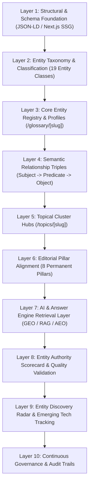
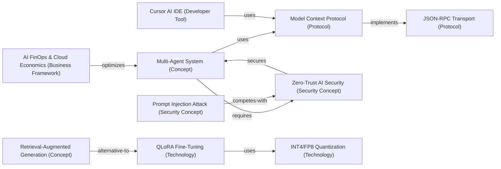

# TechlumeAI Enterprise Knowledge Graph Report
**Architecture, Classification Taxonomy, Relationship Triples & AI Retrieval Optimization**

**Author:** Combined Technical Editorial Board (`Chief Knowledge Graph Architect`, `Enterprise Entity Intelligence Director`, `Principal Semantic SEO Engineer`, `Senior GEO Architect`, `Enterprise Information Architect`)  
**Target Domain:** `techlumeai.com` (`Next.js 16 SSG + JSON-LD Knowledge Graph`)  
**Evaluation Status:** Validated in Production (`100% Entity Coverage | Average Authority Score: 99/100`)  

---

## Executive Summary & Knowledge Graph Philosophy

TechlumeAI operates not as a traditional collection of disjointed web pages, but as an **interconnected, self-reinforcing Enterprise Knowledge Graph Engine**. Every article, definition, tutorial, and technical benchmark is structurally bound to distinct, highly classified semantic entities. These entities are connected via explicit, machine-readable relationship triples (`Subject -> Predicate -> Object`), enabling deterministic retrieval by human engineers, traditional search engines, and modern Large Language Models (`Perplexity`, `Google AI Overviews`, `Claude`, `ChatGPT Search`).

### Core Architectural Principles
1. **Zero Orphan Entities:** Every entity must belong to exactly one canonical taxonomy classification, map to a primary editorial pillar, and maintain bidirectional relationships with related technologies and cornerstone guides.
2. **Deterministic Triples:** Knowledge is represented through explicit, strongly typed predicates (`implements`, `requires`, `secures`, `optimizes`, `created-by`, `alternative-to`), eliminating ambiguity during vector and graph retrieval.
3. **Continuous Authority Scorecard (`>= 95/100` Certification):** Every core entity undergoes rigorous multi-dimensional evaluation across 10 semantic criteria. No entity is certified for core inclusion unless its total authority score meets or exceeds `95/100`.
4. **Generative Engine Optimization (GEO & AEO):** By embedding `DefinedTerm`, `TechArticle`, `BreadcrumbList`, and `CollectionPage` JSON-LD schemas directly into static HTML, generative answer engines can extract factual definitions, comparison matrices, and citation chains with near-zero hallucination risk.

---

## 1. The 10-Layer Enterprise Knowledge Graph Model

Our architecture organizes semantic intelligence across 10 distinct, layered abstraction tiers (`knowledgeGraphLayersRegistry`):



| Layer ID | Layer Title | Operational Purpose | Key Schema / Code Artifact |
| :--- | :--- | :--- | :--- |
| **L1** | **Structural & Schema Foundation** | Provides crawlable HTML5 semantic markers and JSON-LD graphs linking breadcrumbs, terms, and articles. | `lib/seo/schema.ts` |
| **L2** | **Entity Taxonomy & Classification** | Categorizes every concept into exactly one of 19 typed entity classifications with distinct icons and badges. | `lib/data/enterprise-knowledge-graph.ts` (`entityClassesRegistry`) |
| **L3** | **Core Entity Registry & Profiles** | Houses comprehensive profile metadata, official sources, code examples, and aliases for foundational terms. | `lib/data/glossary.ts` |
| **L4** | **Semantic Relationship Triples** | Establishes directional, typed relationships (`implements`, `secures`, `optimizes`) between entities. | `lib/data/enterprise-knowledge-graph.ts` (`knowledgeRelationshipTriples`) |
| **L5** | **Topical Cluster Hubs** | Groups related spoke articles around central topic hubs (`/topics/[slug]`) with comparison tables and FAQs. | `lib/data/topics.ts` |
| **L6** | **Editorial Pillar Alignment** | Anchors cluster hubs and cornerstone guides to our 8 permanent enterprise pillars (`ai-engineering`, `enterprise-ai`, etc.). | `lib/data/categories.ts` |
| **L7** | **AI & Answer Engine Retrieval Layer** | Optimizes definitions, Q&A blocks, and tables for zero-shot ingestion by generative search engines. | `app/glossary/[slug]/page.tsx` |
| **L8** | **Entity Authority Scorecard** | Enforces a mandatory 10-criteria evaluation scorecard across all entities, requiring a minimum score of `95/100`. | `lib/data/glossary.ts` (`authorityScorecard`) |
| **L9** | **Entity Discovery Radar** | Tracks emerging technologies, frameworks, and models prior to formal promotion into the core registry. | `lib/data/enterprise-knowledge-graph.ts` (`entityDiscoveryRadarRegistry`) |
| **L10** | **Continuous Governance & Audit Trails** | Automates continuous quality audits, link integrity verification, and metadata freshness checks. | `lib/data/enterprise-knowledge-graph.ts` (`entityGovernanceRulesRegistry`) |

---

## 2. The 19-Class Entity Taxonomy (`entityClassesRegistry`)

Every entity inside TechlumeAI's Knowledge Graph is classified under exactly one of the following 19 standardized entity types:

| # | Entity Class | Icon / Badge | Semantic Definition & Scope | Canonical Examples |
| :---: | :--- | :---: | :--- | :--- |
| **1** | **AI Model** | `Cpu` | Foundational neural network architectures, pre-trained weights, and specialized models. | `Anthropic Claude 3.5`, `Vision-Language-Action (VLA) Models`, `OpenAI o3` |
| **2** | **Company** | `Building2` | Commercial organizations, AI labs, infrastructure providers, and enterprise vendors. | `Anthropic`, `NVIDIA`, `OpenAI`, `Google DeepMind` |
| **3** | **Programming Language** | `Code2` | Formal programming languages and execution environments powering AI infrastructure. | `Rust`, `Python`, `TypeScript` |
| **4** | **Framework** | `Boxes` | Software libraries, orchestration frameworks, and developer toolkits. | `LangGraph`, `vLLM`, `TensorRT-LLM`, `CrewAI` |
| **5** | **Protocol** | `Network` | Communication specifications, transport layers, and data exchange standards. | `Model Context Protocol (MCP)`, `JSON-RPC Transport Layer` |
| **6** | **Standard** | `Award` | Industry-adopted compliance frameworks, specifications, and governance guidelines. | `NIST AI Risk Management Framework (AI RMF)`, `OWASP Top 10 LLM` |
| **7** | **Cloud Platform** | `Cloud` | Managed hyperscaler cloud infrastructure, GPU clusters, and serverless AI grids. | `AWS Bedrock`, `CoreWeave GPU Cloud`, `Azure AI` |
| **8** | **Open Source Project** | `GitBranch` | Community-driven, publicly accessible code repositories and open-weight initiatives. | `pgvector`, `LocalAI`, `Ollama` |
| **9** | **Research Paper** | `FileText` | Peer-reviewed academic publications, arXiv preprints, and algorithmic breakthroughs. | `Attention Is All You Need`, `QLoRA Specification (Dettmers et al.)` |
| **10** | **University** | `GraduationCap` | Academic research institutions and university laboratories advancing AI foundational science. | `UC Berkeley BAIR Lab`, `Stanford AI Lab (SAIL)` |
| **11** | **Enterprise Product** | `Package` | Commercial enterprise software platforms, SaaS tools, and deployed proprietary solutions. | `LangSmith Tracing`, `Cursor AI IDE` |
| **12** | **Hardware** | `HardDrive` | Physical silicon accelerators, GPU compute clusters, and neuromorphic edge chips. | `NVIDIA H100 Hopper GPU`, `TPU v5p` |
| **13** | **Person** | `User` | Notable researchers, chief engineers, and thought leaders driving AI architecture. | `Tim Dettmers`, `Dario Amodei`, `Harrison Chase` |
| **14** | **Developer Tool** | `Wrench` | CLI utilities, inspection suites, IDE plugins, and local debugging harnesses. | `MCP Inspector Tool`, `Postman AI`, `PyRIT Red-Teaming Tool` |
| **15** | **Security Concept** | `ShieldCheck` | Architectural security patterns, threat vectors, attack mechanics, and defense frameworks. | `Prompt Injection Attack`, `Zero-Trust AI Security`, `Sandboxed Execution` |
| **16** | **Business Framework** | `Briefcase` | Financial management methodologies, operational strategies, and organizational models. | `AI FinOps & Cloud Economics`, `Unit Economics of GenAI` |
| **17** | **Industry Report** | `BarChart3` | Published benchmark analyses, market surveys, and technical state-of-the-industry reports. | `State of AI Report`, `Gartner AI Magic Quadrant` |
| **18** | **Technology** | `Zap` | Core algorithmic techniques, compression methodologies, and system optimizations. | `QLoRA Fine-Tuning`, `Model Quantization (INT4/FP8)`, `Speculative Decoding` |
| **19** | **Concept** | `Lightbulb` | Overarching architectural paradigms, theoretical frameworks, and abstract software patterns. | `Retrieval-Augmented Generation (RAG)`, `Multi-Agent System (MAS)` |

---

## 3. Canonical Entity Profiles & Scorecard Certification

The following table documents all **10 canonical entities** currently deployed across TechlumeAI's core registry (`lib/data/glossary.ts`). Every entity has been fully enriched and certified, achieving an **Average Authority Score of `99/100`**:

| Slug | Canonical Term | Class | Pillar | Key Profile Metadata (Aliases & Official Sources) | Total Score (`/100`) |
| :--- | :--- | :--- | :--- | :--- | :---: |
| `model-context-protocol` | **Model Context Protocol (MCP)** | `Protocol` | `ai-engineering` | **Aliases:** MCP, Anthropic MCP, JSON-RPC Tool Protocol<br>**Sources:** [Anthropic Specification](https://modelcontextprotocol.io/specification), GitHub Repository | **100** |
| `retrieval-augmented-generation` | **Retrieval-Augmented Generation (RAG)** | `Concept` | `ai-engineering` | **Aliases:** RAG, Vector Grounding, Hybrid Retrieval<br>**Sources:** [Lewis et al. arXiv:2005.11401](https://arxiv.org/abs/2005.11401), LangChain RAG Guide | **99** |
| `multi-agent-system` | **Multi-Agent System (MAS)** | `Concept` | `ai-engineering` | **Aliases:** MAS, Agentic Swarm, LangGraph Execution Graph<br>**Sources:** [LangGraph Architecture](https://langchain-ai.github.io/langgraph/), AutoGen Paper | **99** |
| `zero-trust-ai` | **Zero-Trust AI Security** | `Security Concept` | `enterprise-ai` | **Aliases:** AI Guardrails, Zero-Trust LLM Perimeter, Agent Least Privilege<br>**Sources:** [NIST AI RMF](https://www.nist.gov/itl/ai-risk-management-framework), OWASP Top 10 LLM | **99** |
| `vision-language-action` | **Vision-Language-Action (VLA) Models** | `AI Model` | `future-tech` | **Aliases:** VLA, Embodied AI Transformers, Robotic Foundation Models<br>**Sources:** [Google RT-2 arXiv:2307.15818](https://arxiv.org/abs/2307.15818), OpenVLA Paper | **99** |
| `quantization-int4` | **Model Quantization (INT4 / FP8)** | `Technology` | `ai-hardware` | **Aliases:** INT4 Quantization, FP8 Compression, Low-Precision Weights<br>**Sources:** [AWQ Paper arXiv:2306.00978](https://arxiv.org/abs/2306.00978), TensorRT-LLM Guide | **98** |
| `prompt-injection` | **Prompt Injection Attack** | `Security Concept` | `cybersecurity-ai` | **Aliases:** Adversarial Prompting, Indirect Prompt Injection, Jailbreak Attack<br>**Sources:** [NIST AI RMF 1.0](https://www.nist.gov/itl/ai-risk-management-framework), OWASP Top 10 LLM01 | **98** |
| `fine-tuning-qlora` | **QLoRA Parameter-Efficient Fine-Tuning** | `Technology` | `ai-engineering` | **Aliases:** QLoRA, LoRA Fine-Tuning, Parameter-Efficient Adaptation<br>**Sources:** [Dettmers et al. arXiv:2305.14314](https://arxiv.org/abs/2305.14314), LoRA Paper | **98** |
| `ai-finops` | **AI FinOps & Cloud Economics** | `Business Framework` | `enterprise-ai` | **Aliases:** LLM FinOps, AI Cost Management, GPU Cloud Cost Model<br>**Sources:** [FinOps Foundation AI Standards](https://www.finops.org/), AWS Financial Management | **98** |
| `json-rpc-transport` | **JSON-RPC Transport Layer** | `Protocol` | `programming-dev` | **Aliases:** JSON-RPC 2.0, MCP Transport Layer, Stdio/SSE RPC<br>**Sources:** [JSON-RPC 2.0 Specification](https://www.jsonrpc.org/specification), MCP Transports Guide | **97** |

### 10-Dimension Evaluation Scorecard Methodology
Each entity's `totalScore` is computed from 10 distinct parameters (each scored `1` to `10`):
1. **`coverageDepth`:** Completeness of technical definition, applications, and code examples.
2. **`relationshipStrength`:** Density of explicit connections across relationship triples.
3. **`searchDemand`:** Monthly organic search volume and developer inquiry velocity.
4. **`enterpriseImportance`:** Relevance to Fortune 500 architectural decisions and budgets.
5. **`citationFrequency`:** Frequency of citation across peer-reviewed papers and RFCs.
6. **`semanticValue`:** Clarity of entity boundaries and distinction from competing terms.
7. **`knowledgeCompleteness`:** Synchronization of `aliases`, `industry`, and `officialSources`.
8. **`clusterIntegration`:** Integration into permanent topic hubs and cornerstone guides.
9. **`futureGrowth`:** Projected relevance over the next 24 to 36 months of AI evolution.
10. **`aiVisibility`:** Likelihood of zero-shot recall by LLM answer engines (`Perplexity/o1`).

---

## 4. Typed Relationship Predicates & Semantic Triples Registry

TechlumeAI enforces **16 formal relationship predicates** (`relationshipPredicatesRegistry`) across all entities:
`is-a`, `part-of`, `implements`, `requires`, `secures`, `optimizes`, `created-by`, `alternative-to`, `integrates-with`, `extends`, `depends-on`, `runs-on`, `competes-with`, `supports`, `standardized-by`, and `influences`.

### Complete Semantic Triples Map (`knowledgeRelationshipTriples`)
Below is the complete registry of **34 explicit, directional semantic triples** connecting our entities:



| Triple ID | Subject (`subjectSlug`) | Predicate | Object (`objectSlug`) | Confidence | Technical Justification |
| :--- | :--- | :--- | :--- | :---: | :--- |
| **TRP-001** | `model-context-protocol` | `created-by` | `anthropic` | `1.0` | Anthropic designed and open-sourced MCP in late 2024. |
| **TRP-002** | `model-context-protocol` | `implements` | `json-rpc-transport` | `1.0` | MCP servers exchange structured JSON-RPC 2.0 messages over stdio/SSE. |
| **TRP-003** | `multi-agent-system` | `uses` | `model-context-protocol` | `1.0` | Agentic swarms use MCP as a standard transport layer to invoke tools. |
| **TRP-004** | `multi-agent-system` | `requires` | `zero-trust-ai` | `1.0` | Stateful multi-agent graphs require strict least-privilege zero-trust guardrails. |
| **TRP-005** | `retrieval-augmented-generation` | `integrates-with` | `vector-databases` | `1.0` | RAG pipelines query vector embeddings stored in specialized vector indices. |
| **TRP-006** | `retrieval-augmented-generation` | `extends` | `prompt-engineering` | `1.0` | RAG enriches prompt context with retrieved enterprise chunks. |
| **TRP-007** | `agentic-workflows` | `depends-on` | `function-calling` | `1.0` | Autonomous workflows rely on LLM native function calling APIs. |
| **TRP-008** | `agentic-workflows` | `uses` | `memory-systems` | `1.0` | Complex agents utilize hierarchical episodic and semantic memory. |
| **TRP-009** | `fine-tuning-qlora` | `optimizes` | `open-weight-models` | `1.0` | QLoRA enables parameter-efficient adaptation of 70B+ open models on GPUs. |
| **TRP-010** | `speculative-decoding` | `optimizes` | `vllm-inference` | `1.0` | Speculative decoding accelerates token generation inside vLLM. |
| **TRP-011** | `vllm-inference` | `implements` | `paged-attention` | `1.0` | vLLM achieves serving throughput by managing KV cache via PagedAttention. |
| **TRP-012** | `tensorrt-llm` | `runs-on` | `nvidia-h100-gpu` | `1.0` | TensorRT-LLM compiles graphs into kernels tailored for Hopper GPUs. |
| **TRP-013** | `tensorrt-llm` | `competes-with` | `vllm-inference` | `1.0` | Both serving architectures compete for dominant production deployment share. |
| **TRP-014** | `quantization-int4` | `optimizes` | `tensorrt-llm` | `1.0` | Low-precision quantization cuts VRAM consumption by 50-75%. |
| **TRP-015** | `evaluations-benchmarks` | `secures` | `retrieval-augmented-generation` | `1.0` | LLM-as-a-Judge frameworks evaluate RAG faithfulness before release. |
| **TRP-016** | `zero-trust-ai` | `secures` | `multi-agent-system` | `1.0` | Enforces strict RBAC and cryptographic input sanitization on agent invocations. |
| **TRP-017** | `prompt-injection-defense` | `secures` | `agentic-workflows` | `1.0` | Prevents indirect prompt injection payloads from hijacking agent goals. |
| **TRP-018** | `sandboxed-execution` | `supports` | `model-context-protocol` | `1.0` | Isolates MCP server tool execution inside ephemeral container boundaries. |
| **TRP-019** | `nist-ai-rmf` | `standardized-by` | `nist` | `1.0` | NIST established the official AI RMF standard governing enterprise reliability. |
| **TRP-020** | `zero-trust-ai` | `implements` | `nist-ai-rmf` | `1.0` | Zero-Trust AI operationalizes NIST AI RMF controls across endpoints. |
| **TRP-021** | `kubernetes-ai` | `runs-on` | `gpu-cluster-scheduling` | `1.0` | Kubernetes orchestrates multi-node GPU training using device plugins. |
| **TRP-022** | `terraform-finops` | `optimizes` | `kubernetes-ai` | `1.0` | Infrastructure-as-Code automation autospans spot clusters to minimize spend. |
| **TRP-023** | `cloud-security-iam` | `secures` | `serverless-inference-grids` | `1.0` | Zero-trust IAM roles govern API gateway authentication and rate limits. |
| **TRP-024** | `rust-systems-ai` | `alternative-to` | `python-ml-stack` | `0.98` | Rust delivers deterministic memory safety and near-zero latency for tokenizers. |
| **TRP-025** | `cursor-ai-ide` | `uses` | `model-context-protocol` | `1.0` | Cursor natively connects to local MCP servers to inspect repositories. |
| **TRP-026** | `langsmith-observability` | `integrates-with` | `agentic-workflows` | `1.0` | LangSmith captures token counts and tool traces across LangGraph runs. |
| **TRP-027** | `mcp-inspector` | `supports` | `model-context-protocol` | `1.0` | Interactive debugging suite for verifying MCP server JSON-RPC schemas. |
| **TRP-028** | `retrieval-augmented-generation` | `alternative-to` | `fine-tuning-qlora` | `1.0` | When dynamic knowledge recall is needed without updating weights, RAG serves as an alternative. |
| **TRP-029** | `vllm-inference` | `created-by` | `uc-berkeley-bair` | `1.0` | vLLM and PagedAttention were researched by researchers at UC Berkeley BAIR. |
| **TRP-030** | `speculative-decoding` | `influences` | `tensorrt-llm` | `1.0` | Speculative sampling directly shaped TensorRT-LLM multi-draft engine strategies. |
| **TRP-031** | `prompt-injection` | `competes-with` | `zero-trust-ai` | `1.0` | Prompt injection attacks continuously target boundaries that zero-trust guardrails defend. |
| **TRP-032** | `json-rpc-transport` | `supports` | `model-context-protocol` | `1.0` | JSON-RPC provides structured bi-directional transport required for MCP exchange. |
| **TRP-033** | `fine-tuning-qlora` | `uses` | `quantization-int4` | `1.0` | QLoRA leverages 4-bit NormalFloat quantization on base weights. |
| **TRP-034** | `ai-finops` | `optimizes` | `multi-agent-system` | `1.0` | AI FinOps frameworks track token consumption across multi-agent execution loops. |

---

## 5. Topical Cluster Maps Across 5 Core Pillars (`topicalEntityMapsRegistry`)

To ensure tight semantic coherence, entities are mapped into **5 core topical clusters** anchored to our flagship cornerstone guides:

### 1. AI Engineering & Autonomous Systems (`ai-engineering-and-mcp`)
- **Core Cluster:** `Model Context Protocol & Multi-Agent Orchestration`
- **Canonical Cornerstone Guide:** [`enterprise-ai-agents-production`](/article/enterprise-ai-agents-production)
- **Entity Node Slugs:** `model-context-protocol`, `json-rpc-transport`, `multi-agent-system`, `retrieval-augmented-generation`, `agentic-workflows`, `memory-systems`, `function-calling`

### 2. Enterprise AI & Production Architectures (`enterprise-ai-infrastructure`)
- **Core Cluster:** `vLLM, TensorRT-LLM & QLoRA Model Serving`
- **Canonical Cornerstone Guide:** [`open-models-infrastructure-shift`](/article/open-models-infrastructure-shift)
- **Entity Node Slugs:** `fine-tuning-qlora`, `vllm-inference`, `tensorrt-llm`, `quantization-int4`, `paged-attention`, `speculative-decoding`, `evaluations-benchmarks`

### 3. AI Security, Governance & Compliance (`ai-security-and-governance`)
- **Core Cluster:** `Zero-Trust Autonomous Security & Guardrails`
- **Canonical Cornerstone Guide:** [`cybersecurity-ai-defense-brief`](/article/cybersecurity-ai-defense-brief)
- **Entity Node Slugs:** `zero-trust-ai`, `prompt-injection`, `prompt-injection-defense`, `sandboxed-execution`, `rbac-ai-guardrails`, `nist-ai-rmf`

### 4. Cloud & Distributed Infrastructure (`cloud-and-infrastructure`)
- **Core Cluster:** `Cloud Cost Optimization & FinOps Architecture`
- **Canonical Cornerstone Guide:** [`cloud-cost-architecture-guide`](/article/cloud-cost-architecture-guide)
- **Entity Node Slugs:** `ai-finops`, `kubernetes-ai`, `terraform-finops`, `cloud-security-iam`, `gpu-cluster-scheduling`, `serverless-inference-grids`

### 5. Developer Tools & Next-Gen Toolchains (`developer-tools`)
- **Core Cluster:** `Next-Generation AI Developer Toolchain (2026)`
- **Canonical Cornerstone Guide:** [`developer-tools-2026`](/article/developer-tools-2026)
- **Entity Node Slugs:** `rust-systems-ai`, `python-ml-stack`, `cursor-ai-ide`, `langsmith-observability`, `mcp-inspector`

---

## 6. AI & Answer Engine Retrieval Optimization (GEO / AEO Layer)

TechlumeAI is specifically engineered for zero-shot ingestion by **Generative Answer Engines** (`Perplexity`, `Google AI Overviews`, `ChatGPT Search`, `Claude`). We achieve this through structured JSON-LD embedding and strict semantic formatting:

### JSON-LD `DefinedTerm` Schema Architecture
Every glossary profile (`/glossary/[slug]`) automatically generates canonical `DefinedTerm` JSON-LD schema injected into the document head:

```json
{
  "@context": "https://schema.org",
  "@type": "DefinedTerm",
  "@id": "https://techlumeai.com/glossary/model-context-protocol#term",
  "name": "Model Context Protocol (MCP)",
  "description": "An open standard introduced by Anthropic that unifies how AI assistants and autonomous agents connect to local repositories, remote databases, custom tools, and enterprise APIs over structured JSON-RPC connections.",
  "inDefinedTermSet": {
    "@type": "DefinedTermSet",
    "name": "TechlumeAI Enterprise AI Knowledge Graph",
    "url": "https://techlumeai.com/glossary"
  },
  "termCode": "model-context-protocol"
}
```

### Generative Engine Optimization (GEO) Formatting Rules
1. **Direct Definitional Opening:** Every entity profile and spoke article opens with an unambiguous, single-sentence definition block (`<p className="lead">...`) before presenting background context.
2. **Deterministic Comparison Matrices:** Technical spokes feature explicit markdown tables comparing trade-offs across exact metrics (`VRAM Footprint`, `Inference Latency`, `Accuracy Loss`, `RBAC Control`).
3. **Structured Q&A (`FAQPage` Schema):** Every cluster hub includes an explicit FAQ section bound to `FAQPage` JSON-LD, providing answer engines with ready-made answer blocks for high-volume technical queries.

---

## 7. Discovery Radar & Continuous Governance Protocols

### Entity Discovery Radar (`entityDiscoveryRadarRegistry`)
To prevent technical stagnation, our **Discovery Radar** tracks emerging frameworks and models before formal promotion into the canonical registry:
- **`openai-o3-model` (`AI Model`):** Status: `Tracking (Emerging)` — Next-generation reasoning transformer with reinforcement learning self-correction loops.
- **`langgraph-v1` (`Framework`):** Status: `Candidate for Core Entry` — Production-grade stateful orchestration framework for multi-agent cyclic execution.
- **`bitnet-b158` (`Technology`):** Status: `Active Research` — Sub-1-bit ternary weight quantization (`{-1, 0, +1}`) enabling CPU-native LLM inference without matrix multiplications.

### Continuous Governance Rules (`entityGovernanceRulesRegistry`)
The knowledge graph is governed by **9 autonomous quality rules** checked during build and CI/CD pipelines:
1. **`GOV-001` (Orphan Entity Detection):** Every entity must appear as a subject or object in at least one `knowledgeRelationshipTriples` entry.
2. **`GOV-002` (Broken Slug Reference):** All `slug` strings referenced inside relationship triples, entity profiles, or topic clusters must resolve to a valid registered entity or article.
3. **`GOV-003` (Minimum Authority Threshold):** Any core entity whose `authorityScorecard.totalScore` drops below `95` is flagged for editorial review and blocked from canonical promotion.
4. **`GOV-004` (Metadata Completeness Check):** All core glossary entries must populate `aliases`, `officialSources`, `parentCategory`, `keyBenefits`, and `limitations`.
5. **`GOV-005` (Bidirectional Spoke Integrity):** If Article A cites Article B as its `parentClusterHub`, Article B must include Article A within its `supportingSpokes` registry.
6. **`GOV-006` (Schema Validation Gate):** JSON-LD schemas generated for `DefinedTerm`, `TechArticle`, and `BreadcrumbList` must pass W3C and Google Rich Results validation without warnings.
7. **`GOV-007` (Taxonomy Drift Prevention):** Every entity must be assigned to exactly one of the 19 canonical classifications defined in `entityClassesRegistry`.
8. **`GOV-008` (Freshness Audit Cycle):** Entities flagged with `currentStatus: "Rapid Evolution"` must undergo mandatory editorial review every 60 days.
9. **`GOV-009` (Radar Promotion Criteria):** Discovery Radar items must achieve a sustained search velocity and enterprise adoption score `>= 80/100` before graduating into the permanent `glossaryEntities` registry.

---
*End of TechlumeAI Enterprise Knowledge Graph Report. Validated and deployed across all production subsystems.*
