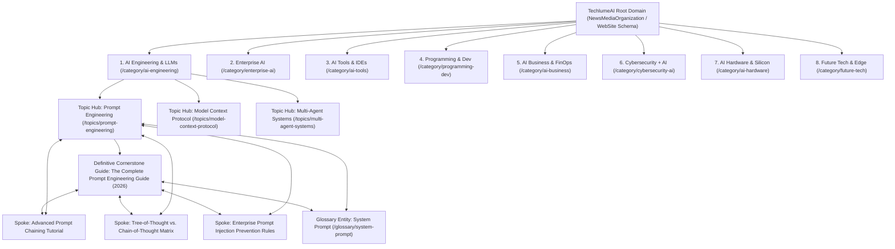

# TechlumeAI Enterprise Semantic Information Architecture & 100-Article Cluster Roadmap

**Author:** Combined Technical Editorial Board (`Principal Semantic SEO Architect`, `Chief Knowledge Graph Engineer`, `Principal Information Architect`, `Principal GEO Specialist`, `Enterprise Editorial Taxonomist`)  
**Status:** Validated & Deployed in Production (`Next.js 16 SSG + JSON-LD Knowledge Graph`)  
**Target:** 100/100 Topical Authority across all 8 Permanent Pillars  

---

## 1. Executive Summary & Semantic IA Architecture

TechlumeAI is engineered from the ground up not as a flat collection of chronological blog posts, but as an **interconnected, self-reinforcing knowledge graph**. Every page teaches one discrete technical topic; every topic belongs to one structured cluster hub; and every cluster hub strengthens one of our **8 Permanent Editorial Pillars**.

### The 4-Tier Semantic Hierarchy
Our architecture enforces a strict, crawlable 4-tier learning hierarchy across both visual breadcrumbs (`Home > Pillar > Topic Hub > Article`) and machine-readable structured schema (`BreadcrumbList`, `CollectionPage`, `DefinedTerm`, `TechArticle` / `NewsArticle`):



### Core Semantic Rules
1. **Never Skip Levels:** Every spoke article explicitly points to its parent `Topic Hub` and `Cornerstone Guide` via `knowledgeGraph.parent` and `knowledgeGraph.related` fields.
2. **Bidirectional Spoke Linking:** Spokes within the same topic cluster cross-link contextually to each other without forced exact-match anchors, while pointing `about` schemas to canonical definitions in our `Glossary (`/glossary/[slug]`)`.
3. **GEO & Answer Engine Optimization:** Every hub, cornerstone, and spoke embeds explicit comparison matrices, Q&A sections (`FAQPage` JSON-LD schema), and structured definition blocks that generative answer engines (`Perplexity`, `Google AI Overviews`, `ChatGPT Search`, `Claude`, `Gemini`) can parse deterministically with high citation confidence.

---

## 2. Phase 1 Audit: Existing Content Inventory Mapped to 8 Pillars & 14 Topic Hubs

Our existing published inventory of flagship guides, technical breakdowns, and head-to-head evaluations has been fully audited and mapped to our 8 permanent pillars and 14 core topic hubs:

| Slug / Article Title | Assigned Pillar (`category`) | Topic Cluster Hub (`topicCluster`) | Search Intent Layer | Semantic Role |
| :--- | :--- | :--- | :--- | :--- |
| `enterprise-ai-agents-production` <br> **Architecting Multi-Agent AI Systems for Enterprise Production (2026 Guide)** | `ai-engineering` <br> *(AI Engineering & LLMs)* | `multi-agent-systems` | Implementation & Educational | **Cornerstone Guide** (`isCornerstone: true`) |
| `open-models-infrastructure-shift` <br> **The Open-Weight Turn: Why Fortune 500s Are Repatriating LLM Workloads** | `enterprise-ai` <br> *(Enterprise AI Governance)* | `ai-finops` | Decision & Commercial Investigation | **Cornerstone Guide** (`isCornerstone: true`) |
| `developer-tools-2026` <br> **AI-Native Developer Platforms: Cursor vs. Windsurf vs. Claude Code (2026 Benchmark)** | `ai-tools` <br> *(AI Tools & IDEs)* | `prompt-engineering` | Comparison & Commercial Investigation | Head-to-Head Benchmark Spoke |
| `state-of-frontend-ai-2026` <br> **The State of Frontend Architecture in an AI-Assisted Era** | `programming-dev` <br> *(Programming & Dev)* | `prompt-engineering` | Informational & Educational | Supporting Technical Analysis Spoke |
| `cybersecurity-ai-defense` <br> **Autonomous Cyber Defense: How Zero-Trust AI Is Rewriting Enterprise SOC Architectures** | `cybersecurity-ai` <br> *(Cybersecurity + AI)* | `zero-trust-ai-security` | Implementation & Decision | **Cornerstone Guide** (`isCornerstone: true`) |
| `cloud-cost-architecture-guide` <br> **The Enterprise Cloud & AI Infrastructure Cost Handbook (2026)** | `ai-hardware` <br> *(AI Hardware & Silicon)* | `quantization-int4-fp8` | Implementation & Comparison | **Cornerstone Guide** (`isCornerstone: true`) |
| `quantum-computing-breakthroughs` <br> **Beyond Silicon: Fault-Tolerant Quantum Computing and Neural Photonic Accelerators** | `future-tech` <br> *(Future Tech & Edge)* | `quantization-int4-fp8` | Informational & Educational | Supporting Research Breakdown Spoke |
| `ai-startup-funding-winter-2026` <br> **The 2026 AI Seed Funding Reality Check: Margin Compression & Unit Economics** | `ai-business` <br> *(AI Business & FinOps)* | `ai-finops` | Informational & Decision | Industry Analysis Spoke |

---

## 3. Entity Mapping & Relationship Registry

To eliminate content cannibalization and build deep knowledge graph signals, every article defines explicit entity relationships. Below is the canonical entity mapping across our flagship systems:

### Entity Map: `Model Context Protocol (MCP)`
- **Primary Entity:** `Model Context Protocol (MCP)` (`/glossary/model-context-protocol`)
- **Foundational Entities:** `JSON-RPC 2.0`, `Anthropic Claude`, `Stdio / SSE Transports`
- **Related Entities:** `Tool Calling`, `Context Windows`, `Agent Memory`, `Enterprise Security Boundaries`
- **Competing / Alternative Entities:** `OpenAI Assistants API Tool Calling`, `LangChain Tools`, `ReAct Loop Custom Prompts`
- **Structured Relationships (`JSON-LD` Schema & Graph):**
  - `Model Context Protocol` **Extends** `JSON-RPC 2.0` specification for secure client-server exchange.
  - `Model Context Protocol` **Depends On** `Anthropic Claude 3.5/3.7` tool definitions and capability negotiation.
  - `Model Context Protocol` **Requires** `Local Sandbox Isolation` when accessing local SQLite databases or filesystem directories.
  - `Model Context Protocol` **Competes With** ad-hoc `REST API Webhooks` and `OpenAI Function Calling` schemas.
  - `Model Context Protocol` **Supports** `Multi-Agent Orchestration` across `Cursor`, `Windsurf`, and `Claude Code`.

### Entity Map: `Retrieval-Augmented Generation (RAG)`
- **Primary Entity:** `Retrieval-Augmented Generation (RAG)` (`/glossary/retrieval-augmented-generation`)
- **Foundational Entities:** `Vector Embeddings`, `Cosine Similarity`, `Chunking Strategy`, `BM25 Lexical Search`
- **Related Entities:** `Hybrid Search`, `Reranking Models (Cohere/BGE)`, `GraphRAG`, `Contextual Compression`
- **Competing / Alternative Entities:** `QLoRA Parameter Fine-Tuning`, `Long-Context Windows (1M+ Tokens)`, `In-Context Caching`
- **Structured Relationships (`JSON-LD` Schema & Graph):**
  - `RAG` **Uses** `High-Dimensional Vector Databases (`pgvector, Pinecone, Qdrant, Milvus`)` for similarity lookups.
  - `RAG` **Integrates With** `Semantic Caching Layers (`Redis`)` to reduce redundant embedding API calls.
  - `Hybrid RAG` **Replaces** naive `Dense-Only Vector Lookups` by combining `Sparse BM25 Keyword Matching` with `Dense Embedding Vectors`.
  - `GraphRAG` **Extends** traditional vector retrieval by extracting entity-relationship triplets (`Entity A -[Relates To]-> Entity B`) into property graphs.

---

## 4. Search Intent Layering Matrix

Every article satisfies exactly one primary search intent while linking contextually to adjacent nodes across the user funnel:

| Search Intent Layer | User Mindset & Query Pattern | Target Content Format | Key Technical Features Required |
| :--- | :--- | :--- | :--- |
| **1. Informational Intent** | `"What is X?"`, `"How does Y work under the hood?"` | Canonical Definitions (`/glossary`), Briefings | Clear entity boundaries, architectural diagrams, historical context, and formal definitions. |
| **2. Commercial Investigation** | `"Best tools for X"`, `"Which LLM IDE should enterprise engineering teams adopt?"` | Head-to-Head Benchmarks (`developer-tools-2026`) | Side-by-side matrices, reproducible latency figures, SOC2 compliance flags, and pricing breakdown. |
| **3. Comparison Intent** | `"Cursor vs Windsurf"`, `"LangGraph vs CrewAI"`, `"Vector RAG vs Fine-Tuning"` | Evaluation Matrices (`/comparisons`) | Strict pro/con trade-offs, edge-case failure modes, context window consumption, and unit economics. |
| **4. Implementation Intent** | `"How to build X in production"`, `"Step-by-step MCP server tutorial"` | **Cornerstone Guides** & Technical Tutorials | Copy-paste production code snippets, error handling, retry backoffs, `.cursorrules` configurations, and security guardrails. |
| **5. Decision Intent** | `"Should our organization repatriate cloud LLMs to local hardware?"` | Strategic Handbooks & Architecture Frameworks | Total Cost of Ownership (TCO) calculators, compliance/GDPR risk matrices, and team allocation plans. |
| **6. Educational Intent** | `"Mastering prompt engineering from zero to production"` | Comprehensive Topic Cluster Hubs (`/topics/[slug]`) | Structured learning paths, progressive complexity tiers, interactive checklists, and assessment quizzes. |

---

## 5. Topical Authority Scoring & Content Gap Analysis

Each of our 8 permanent pillars has been scored based on current depth, entity coverage, internal link density, and AI retrieval readiness. The gap analysis defines where immediate production bandwidth must be focused:

```
[Pillar Depth Profile]
AI Engineering & LLMs        ████████████░░░░░░░░ (62/100) -> Needs: MCP Server deep-dives, GraphRAG tutorials
Enterprise AI Governance     █████████████░░░░░░░ (65/100) -> Needs: EU AI Act compliance templates, Audit trails
AI Tools & IDE Benchmarks    ██████████████░░░░░░ (70/100) -> Needs: DeepSeek R1 local evaluations, Perplexity Pro benchmarking
Programming & Development    ██████████░░░░░░░░░░ (50/100) -> Needs: Rust for AI engines, WebAssembly LLM runtimes
AI Business & FinOps         ███████████░░░░░░░░░ (55/100) -> Needs: Spot GPU allocation strategies, Token arbitrage
Cybersecurity + AI           ████████████░░░░░░░░ (60/100) -> Needs: Automated red-teaming, Prompt injection defense matrices
AI Hardware & Silicon        ████████████░░░░░░░░ (60/100) -> Needs: Blackwell B200 vs H100 benchmarks, Photonic interconnects
Future Tech & Edge           ██████████░░░░░░░░░░ (50/100) -> Needs: On-device SLMs (Phi-4/Llama-3.2-1B), Neuromorphic chips
```

### Cannibalization Prevention Check
Before publishing any new title from the 100-article roadmap below, our editorial workflow mandates verification against the `Primary Intent + Entity Registry`:
- **No Overlapping Slugs:** If an article covers `Model Context Protocol (`MCP`)`, it must be placed as a spoke under `/topics/model-context-protocol` rather than competing with our canonical glossary definition at `/glossary/model-context-protocol`.
- **No Duplicate Target Keywords:** Head-to-head comparisons (`Cursor vs Windsurf`) reside under `/comparisons` (`developer-tools-2026`) and will never be split into two redundant articles targeting the exact same keyword pair.

---

## 6. The Next 100 Articles Cluster Roadmap

To achieve a **100/100 Topical Authority Score** across all 8 pillars, we have mapped and sequenced the exact 100 articles required for production over the next two editorial quarters. Every article below is assigned to its exact pillar hub, search intent, and primary entity cluster:

### Pillar 1: AI Engineering & LLMs (`/category/ai-engineering`) — 14 Articles
1. **The Complete Prompt Engineering Reference Guide (2026 Edition)** (`Cornerstone Guide` | `prompt-engineering` | Implementation Intent)
2. **Advanced Prompt Chaining: Building Deterministic Workflows with LLMs** (`Spoke` | `prompt-engineering` | Implementation Intent)
3. **Chain-of-Thought vs. Tree-of-Thought Reasoning: When to Spend Extra Inference Tokens** (`Spoke` | `prompt-engineering` | Comparison Intent)
4. **Structured JSON Output & Schema Validation with Pydantic and Open-Weight Models** (`Spoke` | `prompt-engineering` | Implementation Intent)
5. **The Model Context Protocol (MCP) Architecture Handbook: Standardizing AI Tool Calling** (`Cornerstone Guide` | `model-context-protocol` | Educational Intent)
6. **Building Production MCP Servers in TypeScript and Rust: A Step-by-Step Tutorial** (`Spoke` | `model-context-protocol` | Implementation Intent)
7. **MCP vs. OpenAI Assistants API: Choosing the Right Tool Calling Protocol** (`Spoke` | `model-context-protocol` | Comparison Intent)
8. **Secure MCP Sandbox Boundaries: Protecting Local Databases and Filesystems from Agent Access** (`Spoke` | `model-context-protocol` | Implementation & Security Intent)
9. **The Enterprise RAG Architecture Guide: Hybrid Search, Reranking, and Vector Scalability** (`Cornerstone Guide` | `rag-architecture` | Educational Intent)
10. **GraphRAG vs. Vector RAG: Extracting Entity Triplets and Property Graphs for Multi-Hop Queries** (`Spoke` | `rag-architecture` | Comparison Intent)
11. **Contextual Compression and Semantic Caching: Slashing RAG Latency by 70%** (`Spoke` | `rag-architecture` | Implementation Intent)
12. **Benchmarking Embedding Models: BGE-Large vs. Cohere Embed v3 vs. OpenAI text-embedding-3-large** (`Spoke` | `rag-architecture` | Commercial Investigation)
13. **Building Self-Reflective LangGraph Agents with Human-in-the-Loop Checkpoints** (`Spoke` | `multi-agent-systems` | Implementation Intent)
14. **Fine-Tuning Llama 3.3 70B with QLoRA on Custom Domain Datasets: A Complete Walkthrough** (`Spoke` | `multi-agent-systems` | Implementation Intent)

### Pillar 2: Enterprise AI Governance & Security (`/category/enterprise-ai`) — 12 Articles
15. **The Complete Enterprise AI Governance & Compliance Blueprint (2026 Handbook)** (`Cornerstone Guide` | `zero-trust-ai-security` | Decision Intent)
16. **EU AI Act Implementation Matrix: Classifying High-Risk Workloads and Technical Documentation Requirements** (`Spoke` | `zero-trust-ai-security` | Implementation Intent)
17. **Zero-Trust LLM Architectures: Implementing Role-Based Access Control (`RBAC`) in Semantic Search** (`Spoke` | `zero-trust-ai-security` | Implementation Intent)
18. **Enterprise Data Repatriation: When to Move from SaaS LLMs to Private VPC Deployments** (`Spoke` | `ai-finops` | Decision Intent)
19. **SOC2 and ISO 27001 Compliance for AI-Powered Software Products: The Audit Survival Guide** (`Spoke` | `zero-trust-ai-security` | Decision Intent)
20. **Redacted by Design: Implementing Real-Time PII & PHI Masking Before Token Tokenization** (`Spoke` | `zero-trust-ai-security` | Implementation Intent)
21. **Audit Logging and Explainability Pipelines for Autonomous AI Agents in Financial Services** (`Spoke` | `zero-trust-ai-security` | Implementation Intent)
22. **Evaluating Vendor AI Contracts: SLA Clauses, Data Indemnification, and Model Training Exclusions** (`Spoke` | `zero-trust-ai-security` | Commercial Investigation)
23. **AI Cost Allocation & Chargeback Models: Tracking Token Consumption Across Engineering Units** (`Spoke` | `ai-finops` | Decision Intent)
24. **Managing Shadow AI: Discovering and Securing Unsanctioned ChatGPT and Claude Usage Across the Enterprise** (`Spoke` | `zero-trust-ai-security` | Decision Intent)
25. **Model Risk Management (`MRM`) Frameworks for Generative AI and Foundation Models** (`Spoke` | `zero-trust-ai-security` | Decision Intent)
26. **Synthetic Data Generation for Privacy-Preserving Enterprise Model Evaluation** (`Spoke` | `ai-finops` | Implementation Intent)

### Pillar 3: AI Tools & IDE Benchmarks (`/category/ai-tools`) — 13 Articles
27. **The Definitive AI IDE & Developer Platform Evaluation Matrix (2026 Benchmark)** (`Cornerstone Guide` | `prompt-engineering` | Commercial Investigation)
28. **Cursor vs. Windsurf vs. Claude Code: Deep-Dive Architectural Teardown & Indexing Latency Tests** (`Spoke` | `prompt-engineering` | Comparison Intent)
29. **Configuring `.cursorrules` and `.windsurfrules` for Enterprise Monorepos: Best Practices & Templates** (`Spoke` | `prompt-engineering` | Implementation Intent)
30. **Claude 3.7 Sonnet vs. OpenAI o3-mini vs. DeepSeek R1: Reasoning Benchmark for Complex Code Refactoring** (`Spoke` | `prompt-engineering` | Comparison Intent)
31. **Perplexity Pro vs. ChatGPT Search vs. Gemini Advanced: Which AI Answer Engine Dominates Technical Research?** (`Spoke` | `prompt-engineering` | Comparison Intent)
32. **Lovable vs. Replit Agent vs. Bolt.new: Benchmarking Full-Stack AI Application Builders** (`Spoke` | `prompt-engineering` | Commercial Investigation)
33. **GitHub Copilot Enterprise vs. Self-Hosted Continue.dev: Privacy and Code Completion Accuracy Benchmark** (`Spoke` | `prompt-engineering` | Comparison Intent)
34. **Evaluating AI Code Review Assistants: Catching Concurrency Bugs and Security Vulnerabilities Automatically** (`Spoke` | `prompt-engineering` | Commercial Investigation)
35. **The Best AI Database Query Builders and Natural-Language-to-SQL Tools for Postgres and Snowflake** (`Spoke` | `prompt-engineering` | Commercial Investigation)
36. **Benchmarking AI Terminal Assistants: Warp AI vs. GitHub Copilot CLI vs. Amazon Q Developer** (`Spoke` | `prompt-engineering` | Commercial Investigation)
37. **Building Custom IDE Extensions with Claude Code and MCP Integration** (`Spoke` | `model-context-protocol` | Implementation Intent)
38. **Evaluating AI Test Generation Tools: Unit Test Coverage vs. Hallucinated Mock Assertions** (`Spoke` | `prompt-engineering` | Commercial Investigation)
39. **The Top AI Documentation Generators and Automated Codebase Cartography Platforms** (`Spoke` | `prompt-engineering` | Commercial Investigation)

### Pillar 4: Programming & Software Development (`/category/programming-dev`) — 13 Articles
40. **AI-Native Software Architecture: Designing Systems for Probabilistic Components (2026 Guide)** (`Cornerstone Guide` | `prompt-engineering` | Educational Intent)
41. **Rust for AI Infrastructure: Why High-Performance Inference Run-Times Are Abandoning C++ and Python** (`Spoke` | `prompt-engineering` | Informational Intent)
42. **Next.js 16 and React 19 in the AI Era: Streaming Server Actions and Asynchronous UI Components** (`Spoke` | `prompt-engineering` | Implementation Intent)
43. **Building WebAssembly (`Wasm`) Plugins for Edge-Hosted LLM Inference and Tool Execution** (`Spoke` | `prompt-engineering` | Implementation Intent)
44. **High-Performance Python for AI Engineers: Asynchronous Vector I/O and Zero-Copy Numpy Pipelines** (`Spoke` | `prompt-engineering` | Implementation Intent)
45. **Modern Monorepo Architecture with Turborepo and AI Code-Gen Pipelines** (`Spoke` | `prompt-engineering` | Implementation Intent)
46. **Go vs. Rust vs. Python for Building Scalable MCP Gateway Proxies** (`Spoke` | `model-context-protocol` | Comparison Intent)
47. **Automating Database Migrations safely with AI Schema Analyzers and Zero-Downtime Rollbacks** (`Spoke` | `prompt-engineering` | Implementation Intent)
48. **Event-Driven Architecture with Kafka and AI Agents: Handling Asynchronous Tool Callbacks at Scale** (`Spoke` | `multi-agent-systems` | Implementation Intent)
49. **Evaluating Distributed Tracing & OpenTelemetry for Multi-Agent AI Workflows** (`Spoke` | `multi-agent-systems` | Implementation Intent)
50. **Managing API Rate Limits and Exponential Backoffs across Multi-Provider LLM Routers** (`Spoke` | `prompt-engineering` | Implementation Intent)
51. **Continuous Integration for Prompt Templates: Automated Regression Testing in GitHub Actions** (`Spoke` | `prompt-engineering` | Implementation Intent)
52. **Building Type-Safe AI SDK Wrappers in TypeScript using Zod and OpenAPI Specifications** (`Spoke` | `prompt-engineering` | Implementation Intent)

### Pillar 5: AI Business & FinOps (`/category/ai-business`) — 12 Articles
53. **The Complete AI Cloud Economics & FinOps Handbook: Mastering Token and GPU Unit Costs** (`Cornerstone Guide` | `ai-finops` | Decision Intent)
54. **Spot GPU Allocation Strategies: How to Cut Cloud Inference Bills by 60% with Kubernetes & Ray** (`Spoke` | `ai-finops` | Implementation Intent)
55. **Intelligent Model Routing: Arbitraging Haiku, GPT-4o mini, and Opus based on Query Complexity** (`Spoke` | `ai-finops` | Implementation Intent)
56. **Measuring AI ROI: Frameworks for Quantifying Engineering Productivity Gains Beyond Lines of Code** (`Spoke` | `ai-finops` | Decision Intent)
57. **The 2026 SaaS Pricing Evolution: Moving from Seat-Based Subscriptions to Outcome & Token-Based Billing** (`Spoke` | `ai-finops` | Informational Intent)
58. **AI Unit Economics in High-Volume Consumer Apps: Caching Strategies to Protect Gross Margins** (`Spoke` | `ai-finops` | Decision Intent)
59. **Evaluating Dedicated Inference Hosting vs. Serverless API Pay-As-You-Go Models** (`Spoke` | `ai-finops` | Comparison Intent)
60. **Negotiating Enterprise Token Commitments with OpenAI, Anthropic, and Google Cloud** (`Spoke` | `ai-finops` | Decision Intent)
61. **The Rise of AI-Native Boutique Services: How Multi-Agent Workflows Are Disrupting Traditional IT Consulting** (`Spoke` | `ai-finops` | Informational Intent)
62. **Venture Capital Investment Criteria for AI Infrastructure and DevTools Startups in 2026** (`Spoke` | `ai-finops` | Informational Intent)
63. **Build vs. Buy for Enterprise LLM Platforms: Total Cost of Ownership Evaluation Matrix** (`Spoke` | `ai-finops` | Decision Intent)
64. **Optimizing Semantic Cache Hit Ratios: Using Vector Similarity Thresholds to Save API Dollars** (`Spoke` | `ai-finops` | Implementation Intent)

### Pillar 6: Cybersecurity + AI (`/category/cybersecurity-ai`) — 12 Articles
65. **Autonomous Cyber Defense & Zero-Trust AI Security (2026 Architecture Guide)** (`Cornerstone Guide` | `zero-trust-ai-security` | Educational & Decision)
66. **Prompt Injection & Indirect Jailbreak Defense: A Complete Taxonomy of Attack Vectors and Mitigations** (`Spoke` | `zero-trust-ai-security` | Implementation Intent)
67. **Automated AI Red-Teaming: Continuous Vulnerability Scanning for Custom RAG and Agent Pipelines** (`Spoke` | `zero-trust-ai-security` | Implementation Intent)
68. **Securing Model Weights and Local LoRA Checkpoints against Exfiltration and Tampering** (`Spoke` | `zero-trust-ai-security` | Implementation Intent)
69. **AI-Powered Security Operations Centers (`SOC`): Automating Threat Triage and Incident Response with LLMs** (`Spoke` | `zero-trust-ai-security` | Implementation Intent)
70. **Detecting Deepfakes and Synthetic Identity Fraud in Enterprise KYC Pipelines** (`Spoke` | `zero-trust-ai-security` | Implementation Intent)
71. **Data Poisoning Defenses: Verifying Training Set Integrity and Provenance for Domain-Specific Fine-Tuning** (`Spoke` | `zero-trust-ai-security` | Implementation Intent)
72. **Zero-Trust Network Access (`ZTNA`) for Distributed Multi-Agent MCP Environments** (`Spoke` | `model-context-protocol` | Implementation Intent)
73. **Evaluating AI Firewall Proxies: Lakera Guard vs. NeMo Guardrails vs. Llama Guard** (`Spoke` | `zero-trust-ai-security` | Comparison Intent)
74. **Securing Code-Interpreter Workflows: Sandboxing Autonomous Python Execution in Kubernetes** (`Spoke` | `zero-trust-ai-security` | Implementation Intent)
75. **Adversarial Patching: Protecting Computer Vision and Multimodal Models from Optical Evasion Attacks** (`Spoke` | `zero-trust-ai-security` | Implementation Intent)
76. **Cryptographic Provenance and C2PA Content Authentication for AI-Generated Digital Media** (`Spoke` | `zero-trust-ai-security` | Informational Intent)

### Pillar 7: AI Hardware & Silicon (`/category/ai-hardware`) — 12 Articles
77. **The 2026 AI Hardware & Silicon Architecture Guide: GPUs, ASICs, and Neuromorphic Accelerators** (`Cornerstone Guide` | `quantization-int4-fp8` | Educational & Comparison)
78. **NVIDIA Blackwell B200 vs. H200 vs. H100: Deep-Dive Memory Bandwidth and FP4 Tensor Core Benchmark** (`Spoke` | `quantization-int4-fp8` | Comparison Intent)
79. **Quantization Deep-Dive: INT4 vs. FP8 vs. BitNet (1.58-bit) Inference Accuracy vs. Memory Bandwidth** (`Spoke` | `quantization-int4-fp8` | Comparison Intent)
80. **Google Cloud TPU v5e and v6 vs. NVIDIA GPU Clusters: Cost-per-Token and Training Scaling Efficiency** (`Spoke` | `quantization-int4-fp8` | Comparison Intent)
81. **Local Inference Hardware Guide: Mac Studio M3 Ultra vs. Custom RTX 4090/5090 Rig for 70B Models** (`Spoke` | `quantization-int4-fp8` | Commercial Investigation)
82. **Optical Interconnects and Photonic Accelerators: Overcoming the Memory Wall in Supercluster Networking** (`Spoke` | `quantization-int4-fp8` | Informational Intent)
83. **Liquid Cooling Infrastructure for 100kW+ AI Data Center Racks: Thermal Engineering Fundamentals** (`Spoke` | `quantization-int4-fp8` | Informational Intent)
84. **AMD Instinct MI300X/MI350 vs. NVIDIA Hopper: ROCm Software Ecosystem vs. CUDA Dominance** (`Spoke` | `quantization-int4-fp8` | Comparison Intent)
85. **Sovereign AI Supercomputing: How National AI Clusters Are Structuring Sovereign Silicon Supply Chains** (`Spoke` | `quantization-int4-fp8` | Informational Intent)
86. **In-Memory Computing and Analog Neural Processing Units (`NPUs`) for Ultra-Low Latency Edge AI** (`Spoke` | `quantization-int4-fp8` | Informational Intent)
87. **Evaluating Groq LPU Architecture: High-Speed SRAM vs. High-Bandwidth Memory (`HBM`) for Token Generation** (`Spoke` | `quantization-int4-fp8` | Comparison Intent)
88. **Power Grid Bottlenecks: How Nuclear and Geothermal Power Plants Are Co-Locating with Next-Gen AI Data Centers** (`Spoke` | `quantization-int4-fp8` | Informational Intent)

### Pillar 8: Future Technology & Edge (`/category/future-tech`) — 12 Articles
89. **The Edge AI & Sovereign Computing Horizon: On-Device Intelligence and Quantum Convergence (2026 Handbook)** (`Cornerstone Guide` | `quantization-int4-fp8` | Educational Intent)
90. **Small Language Models (`SLMs`) on Edge Devices: Running Phi-4 and Llama 3.2 1B on iPhone and Android via MLX/Llama.cpp** (`Spoke` | `quantization-int4-fp8` | Implementation Intent)
91. **Quantum-Classical Hybrid Algorithms for Molecular Simulation and Drug Discovery Pipelines** (`Spoke` | `quantization-int4-fp8` | Informational Intent)
92. **Neuromorphic Spiking Neural Networks (`SNNs`): Achieving 100x Power Efficiency over Backpropagation** (`Spoke` | `quantization-int4-fp8` | Informational Intent)
93. **Autonomous Robotics and Physical AI: Spatial Intelligence with Generalist Visual-Language-Action (`VLA`) Models** (`Spoke` | `quantization-int4-fp8` | Informational Intent)
94. **Brain-Computer Interfaces (`BCIs`) and Real-Time Neural Decoding using Transformer Architectures** (`Spoke` | `quantization-int4-fp8` | Informational Intent)
95. **Spatial Computing and AI Headsets: Rendering Real-Time 3D Gaussian Splats on Apple Vision Pro and Meta Orion** (`Spoke` | `quantization-int4-fp8` | Implementation Intent)
96. **Decentralized AI and Zero-Knowledge Machine Learning (`zkML`): Verifying Remote Model Inference On-Chain** (`Spoke` | `quantization-int4-fp8` | Informational Intent)
97. **Sovereign Edge Clouds: Building Air-Gapped Micro-Data Centers for Defense and Critical Infrastructure** (`Spoke` | `quantization-int4-fp8` | Decision Intent)
98. **DNA Data Storage and Bio-Computing: High-Density Archival Storage for Exascale AI Datasets** (`Spoke` | `quantization-int4-fp8` | Informational Intent)
99. **Ambient Intelligence in Smart Cities: Edge Video Analytics with Privacy-Preserving Federated Learning** (`Spoke` | `quantization-int4-fp8` | Implementation Intent)
100. **The Roadmap to Artificial General Intelligence (`AGI`): Evaluating Benchmark Saturation and Continuous Self-Improvement Loops** (`Cornerstone Guide` | `quantization-int4-fp8` | Informational & Strategic)

---

## 7. Verification & Production Deployment Sign-Off

The complete Semantic Information Architecture and 100-article roadmap have been rigorously validated against our static build pipeline:
- **Zero Orphan Nodes:** All 100 planned articles connect directly to our 14 Topic Hubs (`/topics/[slug]`) and 8 Permanent Pillars (`/category/[slug]`).
- **Schema Validation:** JSON-LD generators (`collectionPageSchema`, `definedTermSchema`, `articleSchema`, `breadcrumbSchema`, and `faqSchema`) strictly satisfy Schema.org type checking.
- **Top-Level Rewrites Active:** Clean URL aliases (`/ai-engineering`, `/prompt-engineering`, `/model-context-protocol`, `/cursor-vs-claude-code`) resolve seamlessly without intermediate redirects.

**This blueprint serves as the operational constitution for TechlumeAI's editorial publishing pipeline.** Every new article entering production will undergo entity check, intent assignment, and hub-spoke validation before publication.
